# APP-1001 — OmniVerse Grafana Onboarding

## Overview

This application onboarding package documents the integration of **OmniVerse Grafana** with Microsoft Entra ID using SAML 2.0.

## Business Request

The Infrastructure Operations team requested SSO for Grafana to reduce local account usage, centralize authentication, and prepare for group-based access control.

## Implementation Summary

| Area | Configuration |
|---|---|
| Application | OmniVerse Grafana |
| Protocol | SAML 2.0 |
| Identity Provider | Microsoft Entra ID |
| Service Provider | Grafana Cloud |
| Provisioning | Manual |
| Access Model | Group-based RBAC planned |
| Status | SAML configured and enabled |

## Screenshots

### 1. Application Overview
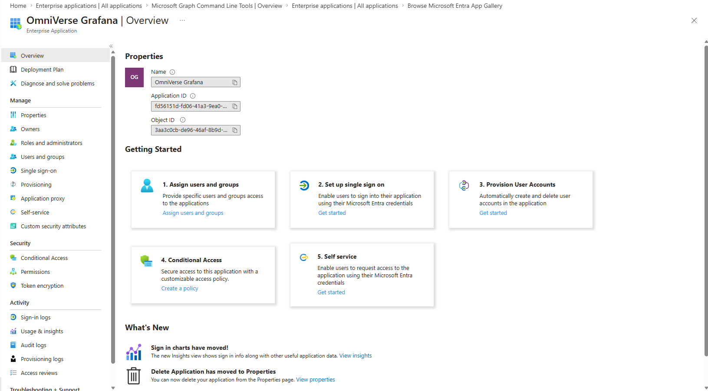

### 2. Blank SAML Configuration
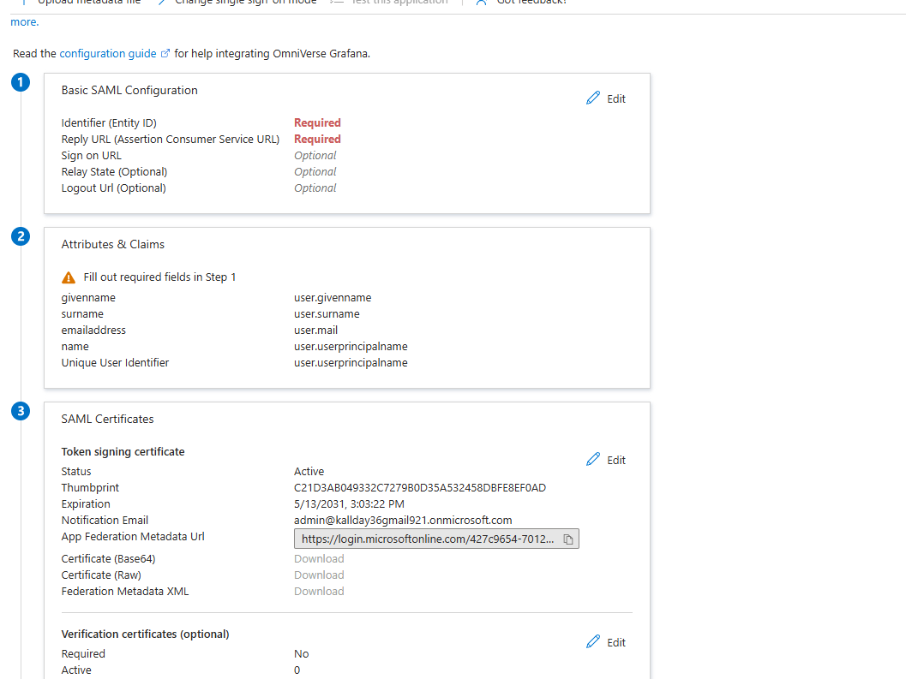

### 3. Basic SAML Configuration
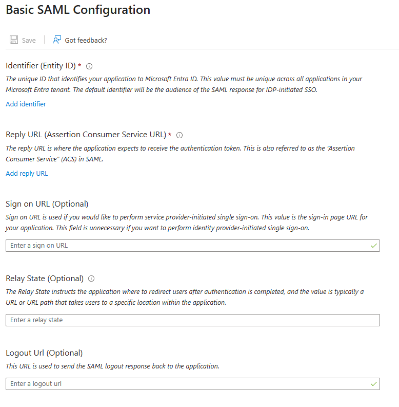

### 4. Grafana SAML General Settings
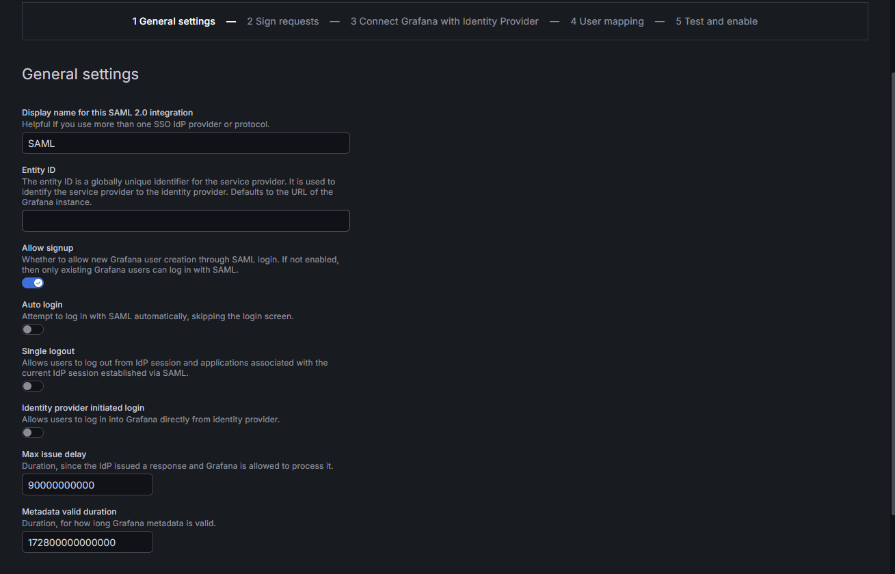

### 5. Grafana Sign Requests
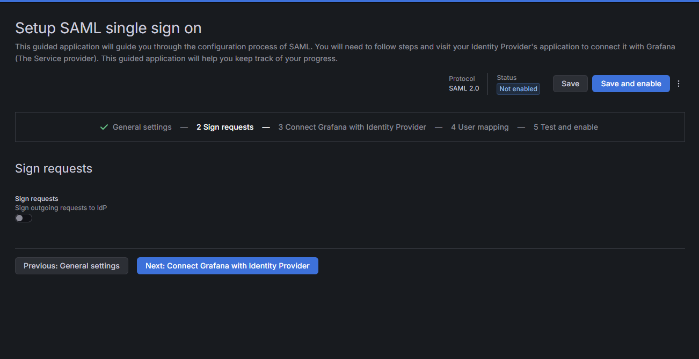

### 6. Grafana Connect Identity Provider
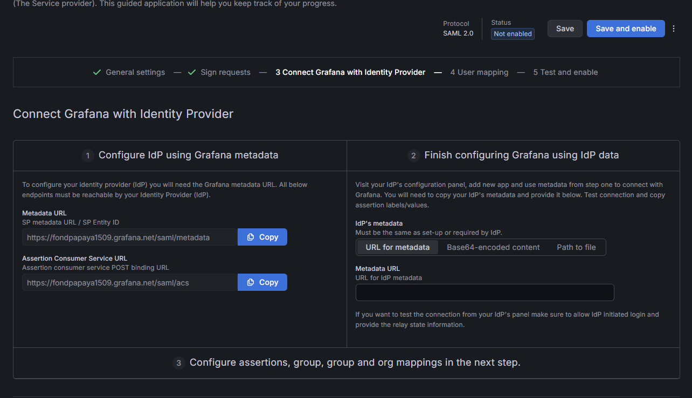

### 7. Entra Basic SAML Configuration
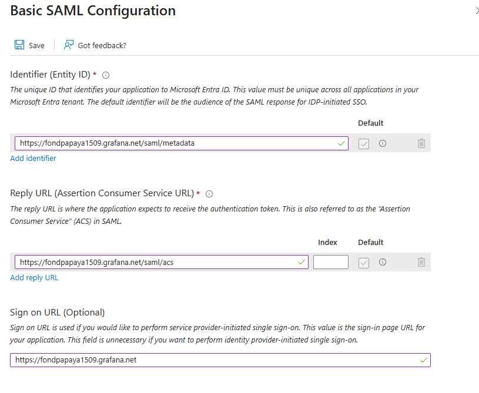

### 8. Default Attributes and Claims
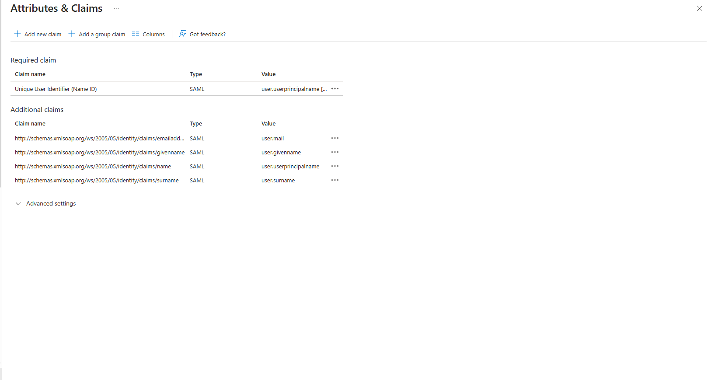

### 9. Advanced SAML Claims
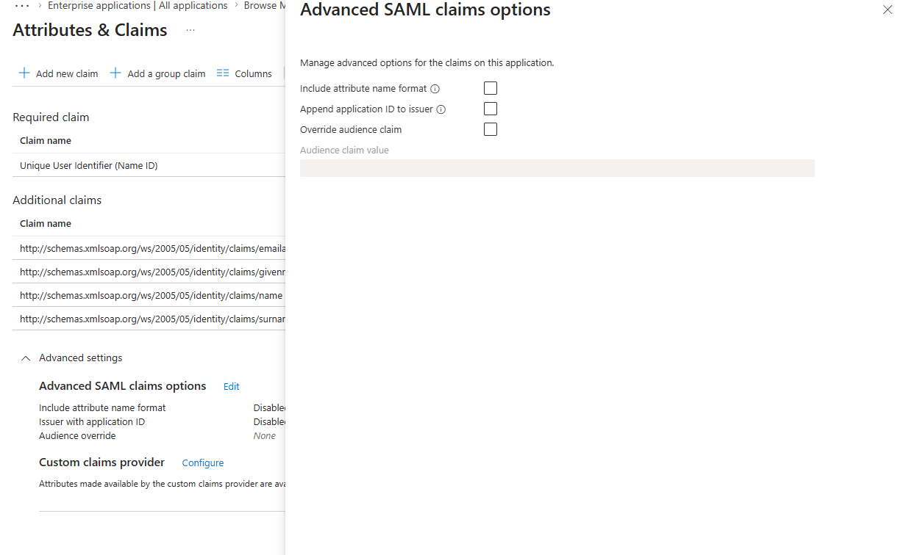

### 10. Group Claim Added
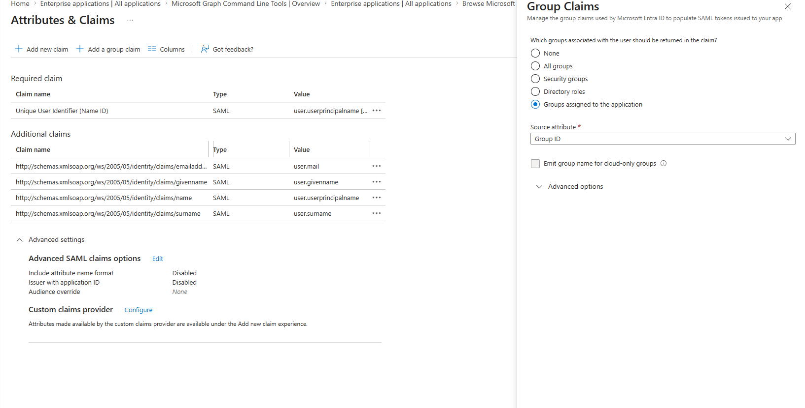

### 11. SAML Certificate and Metadata
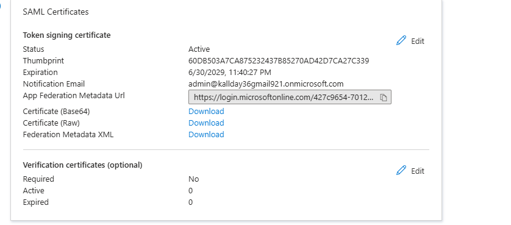

### 12. Grafana IdP Metadata
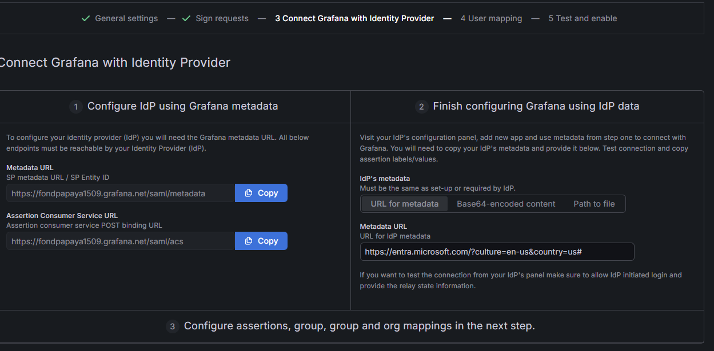

### 13. Grafana User Mapping
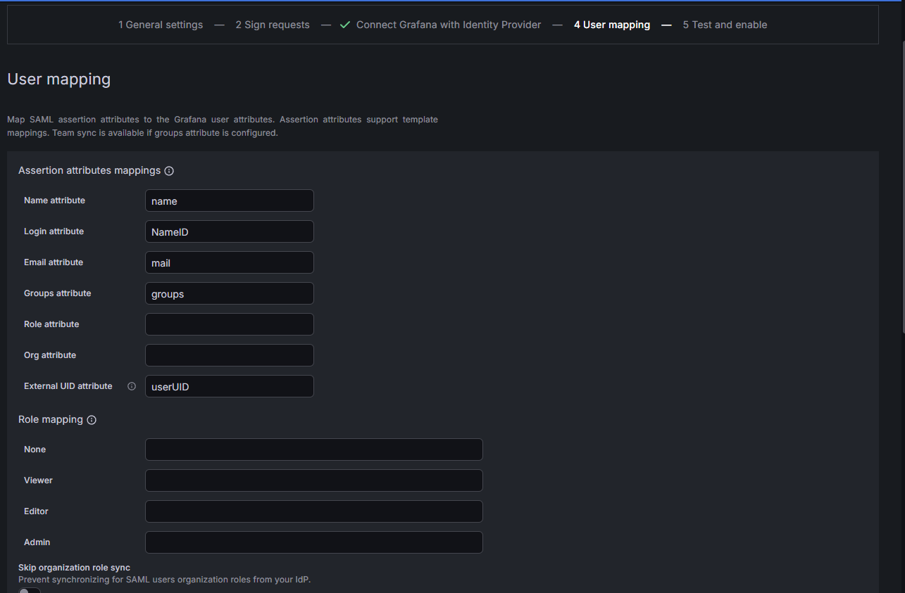

### 14. SAML Enabled
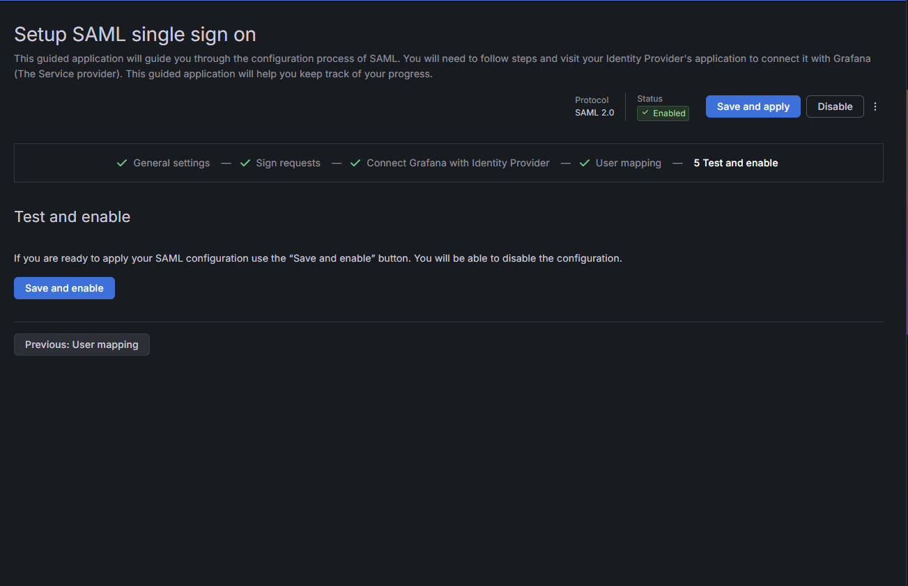

### 15. SAML Ready
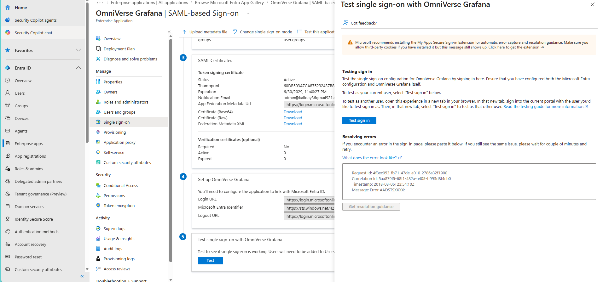

## Outcome

The Grafana SAML configuration was completed and enabled using Microsoft Entra ID as the Identity Provider.
