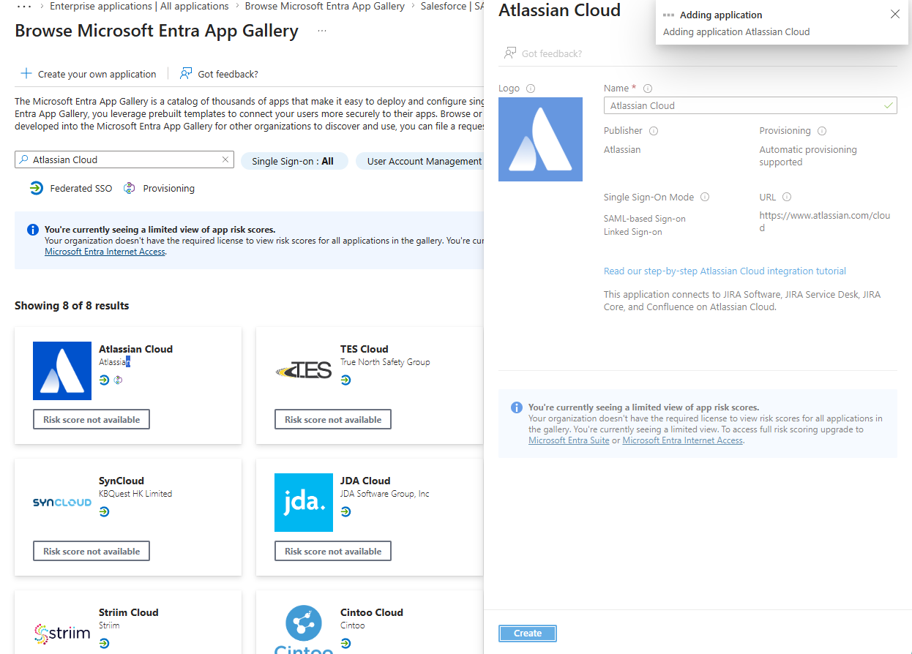
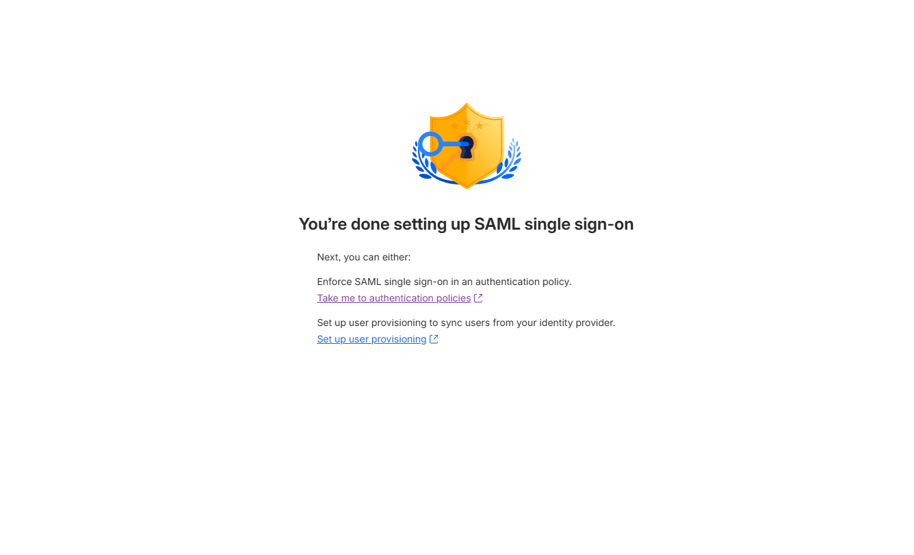
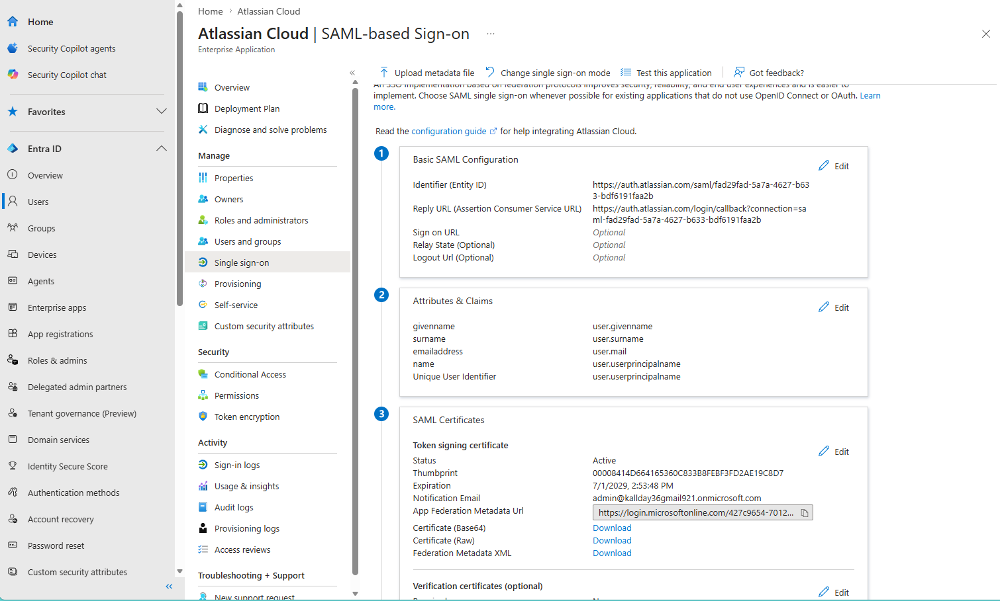
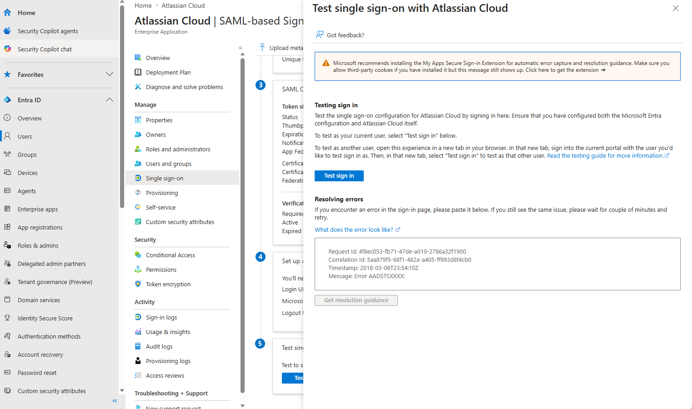
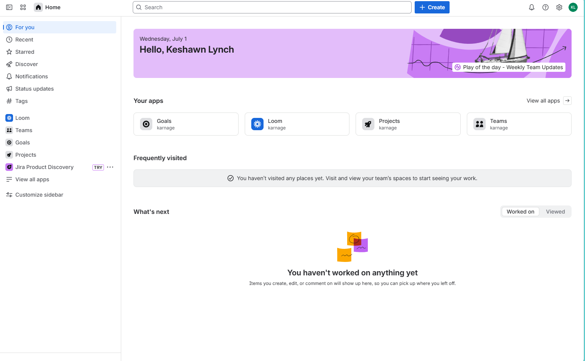

# APP-1005 — Atlassian Jira Cloud Application Onboarding

## Enterprise Application Packages

- [Repository Home](../../README.md)
- [Grafana SAML Onboarding](../Grafana/README.md)
- [WordPress OIDC Onboarding](../WordPress/README.md)
- [GitHub Enterprise SAML Onboarding](../GitHub-Enterprise/README.md)
- [Salesforce SAML Onboarding](../Salesforce/README.md)
- [ServiceNow SAML Onboarding](../ServiceNow/README.md)
- [Slack SAML Onboarding](../Slack/README.md)
- [Zoom SAML Onboarding](../Zoom/README.md)
- [SCIM Provisioning](../SCIM-Provisioning/README.md)

---

## 1. Business Request

The Engineering and Project Management teams requested Single Sign-On for Atlassian Jira Cloud to centralize authentication, reduce local credential dependency, and align Atlassian access with Microsoft Entra ID.

---

## 2. Authentication Protocol

| Area | Configuration |
|---|---|
| Protocol | SAML 2.0 |
| Identity Provider | Microsoft Entra ID |
| Service Provider | Atlassian Cloud |
| Platform | Atlassian Guard |
| Authentication Flow | SAML SSO |
| Certificate | Microsoft Entra token signing certificate |

---

## 3. Provisioning Method

| Area | Configuration |
|---|---|
| Provisioning Method | Manual |
| SCIM | Not configured in this phase |
| Future State | SCIM provisioning and group synchronization |

Provisioning was intentionally left for a later SCIM-focused project so this onboarding package could focus on SAML authentication and trust establishment.

---

## 4. Groups / RBAC

Jira authorization is managed through Atlassian groups and project permissions. This phase focused on authentication only.

Future RBAC model:

| Group | Purpose |
|---|---|
| Jira-Admins | Jira administration |
| Jira-Developers | Project contributor access |
| Jira-Viewers | Read-only access |
| Jira-ServiceDesk | Service desk users |

---

## 5. Claims / Attributes

| Claim / Attribute | Source |
|---|---|
| NameID | user.userprincipalname |
| Email Address | user.mail |
| Given Name | user.givenname |
| Surname | user.surname |

---

## 6. Configuration Steps

1. Created the Atlassian Jira Cloud environment.
2. Started the Atlassian Guard SAML setup workflow.
3. Created the Atlassian Cloud Enterprise Application in Microsoft Entra ID.
4. Copied Microsoft Entra IdP values into Atlassian.
5. Imported the Microsoft Entra X.509 signing certificate.
6. Copied the Atlassian Service Provider Entity ID and ACS URL into Microsoft Entra ID.
7. Saved the SAML configuration in Atlassian Guard.
8. Tested the SSO flow.
9. Validated successful access to Atlassian Cloud.

---

## 7. Validation

Validation confirmed:

- Atlassian accepted the Microsoft Entra IdP configuration.
- Microsoft Entra ID accepted the Atlassian SP Entity ID and ACS URL.
- Atlassian completed the SAML setup workflow.
- The user successfully accessed Atlassian Cloud after the SAML login flow.

---

## 8. Troubleshooting

### Issue 1 — Initial Login Retry Required

During testing, the first SAML login attempt displayed a temporary Atlassian authentication message:

```text
Hmm... We're having trouble logging you in.
```

The login was retried and the user successfully reached the Atlassian Cloud home page.

This was documented as normal post-configuration behavior that may occur because of browser session state, propagation timing, or an active Atlassian session immediately after enabling SAML.

---

## 9. Operational Handoff

| Area | Owner |
|---|---|
| Application Owner | Engineering / Project Management |
| Identity Owner | IAM Team |
| Support Team | Atlassian / Collaboration Support |
| Authentication | SAML 2.0 |
| Provisioning | Manual |
| Future Work | SCIM provisioning and authentication policy enforcement |

---

## 10. Screenshots

### 1. Jira Home

Shows the Atlassian / Jira environment used for onboarding.


---

### 2. Atlassian Cloud Gallery App

Shows Atlassian Cloud selected from Microsoft Entra.



---

### 3. SAML Setup Start

Shows the Atlassian Guard SAML setup workflow.


---

### 4. Identity Provider Configuration

Shows Microsoft Entra IdP values entered into Atlassian.


---

### 5. Microsoft Entra SAML Settings

Shows Microsoft Entra ID configured with Atlassian SAML values.



---

### 6. Service Provider URLs

Shows the Atlassian-generated Service Provider Entity ID and ACS URL required by Microsoft Entra ID.


---

### 7. SAML Configuration Complete

Shows Atlassian SAML setup completion.



---

### 8. SSO Test

Shows the SSO test workflow.



---

### 9. SSO Success

Shows successful access to Atlassian Cloud after SAML authentication.



---

## Engineering Takeaways

This onboarding demonstrated:

- Atlassian Guard SAML configuration
- Microsoft Entra Enterprise Application onboarding
- Identity Provider metadata exchange
- Service Provider metadata exchange
- X.509 certificate handling
- Entity ID and ACS URL configuration
- SSO validation
- Authentication troubleshooting
- Operational handoff documentation
